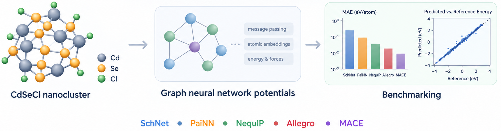

#  
Data and trained models accompanying the paper:

**"Benchmarking Machine-Learning Interatomic Potentials for Dynamical Stability in Inorganic Semiconductor Nanocrystals: A CdSe Case Study"**

Muhammed Usman, Masuma Suleymanova, Zain Ul Abideen, Mario Fernández-Pendás, and Ivan Infante — 


<p align="center">
  
</p>

## Overview

This repository provides the DFT reference dataset and the best-performing trained model checkpoints for five graph-neural-network interatomic potentials **(SchNet, PaiNN, NequIP, Allegro, MACE)** benchmarked on a chloride-passivated CdSe nanocluster **(Cd₆₈Se₅₅Cl₂₆, 149 atoms)**. All models were trained and evaluated using the [Orchestr.AI](https://github.com/nlesc-nano/Orchestr.AI) automated pipeline.

## Repository Structure

### `CdSe Dataset/`

DFT reference configurations for the **Cd₆₈Se₅₅Cl₂₆ nanocluster**, computed with **CP2K** (HLE17/DZVP-MOLOPT, GPW formalism, non-periodic boundary conditions).

| File | Description |
|------|-------------|
| `Full_dataset.xyz` | Complete pool of **3000 configurations** extracted from a **7.5 ps AIMD** production run **(NVT, 300 K)**. Each frame contains atomic positions, DFT total energies (eV), and atomic forces (eV/Å) in extended XYZ format. |
| `consolidated_training_dataset_1000.xyz` | Curated subset of **1000 configurations** selected from the full pool via outlier filtering **(Isolation Forest)**, **PCA dimensionality reduction**, and **k-means clustering** to maximize **structural diversity**. This is the dataset used to train and validate all five MLIP architectures reported in the paper. |

### `CdSe BEST MODELS/`

Best-performing trained model checkpoint for each architecture (hidden dimension = 128, 4 interaction layers), as reported in the paper.

| Subfolder | File | Architecture | Format |
|-----------|------|--------------|--------|
| **`Allegro/`** | `best_model_allegro_cueq.nequip.pth` | **Allegro** | NequIP/Allegro PyTorch checkpoint |
| **`Nequip/`** | `best_model_cueq.nequip.pth` | **NequIP** | NequIP PyTorch checkpoint |
| **`SchNet/`** | `best_inference_model_schnet` | **SchNet** | SchNetPack inference model |
| **`PaiNN/`** | `best_inference_model_painn` | **PaiNN** | SchNetPack inference model |
| **`Mace/`** | `mace_cdsecl_model_compiled.model` | **MACE** | MACE compiled model |

## Dataset Format

The `.xyz` files follow the extended XYZ convention:

```
149
Lattice="23.60 0.0 0.0 0.0 23.60 0.0 0.0 0.0 23.60" Properties=species:S:1:pos:R:3:forces:R:3 pbc="F F F" energy=-113163.558581
Cd  9.324293  10.385074  7.873353  0.000351  -0.003303  -0.000793
...
```

Each frame includes: **atom species, Cartesian positions (Å), atomic forces (eV/Å), lattice vectors, and total energy (eV).**

## Related Resources

- [**Orchestr.AI Repository**](https://github.com/nlesc-nano/Orchestr.AI) 

## Citation
**If you use the dataset or models from this repository, please cite:**

```bibtex
@article{usman2026benchmarking,
  title={Benchmarking Machine-Learning Interatomic Potentials for Dynamical Stability in Inorganic Semiconductor Nanocrystals: A CdSe Case Study},
  author={Muhammed Usman and Masuma Suleymanova and Zain Ul Abideen and Mario Fernández-Pendás and Ivan Infante},
  journal={},
  year={2026}
}
```
## License

Please contact the corresponding author (ivan.infante@bcmaterials.net) for terms of use.
